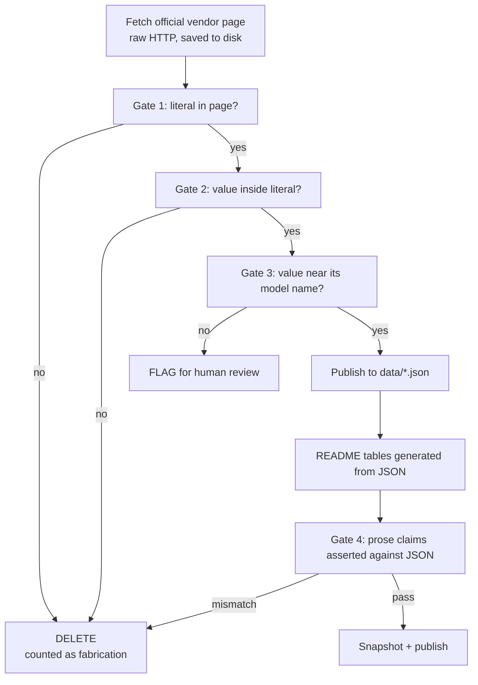

# inference-cost-truth

What LLM inference actually costs, per million tokens, across closed APIs,
hosted open-model APIs, and self-hosted GPUs. Every price carries a source URL
and the date it was read. Verified on **2026-07-31**.

**Who maintains this and why that matters.** This repo is maintained by
RightNow AI, which sells GPU kernel optimization at
[runinfra.ai](https://runinfra.ai). We make money when people run models on
their own GPUs. That is a direct conflict of interest with the question this
repo answers, so read the numbers adversarially.

The finding that cuts against us is in the head-to-head table below. **At 30%
utilization, which is generous for most real deployments, buying the open model
from a hosted API is cheaper than renting GPUs to serve it yourself in two of
the three comparisons we can make like-for-like.** The exception is MiniMax-M3
on AMD MI355X at concurrency 512, which reaches $0.93 per 1M output against
$1.20 hosted. That exception is instructive rather than encouraging: it needs
the cheapest AMD capacity on the market, a batch size of 512, 1k input lengths,
and 30% sustained utilization, all at once. Miss any one and the API wins.
None of this counts engineer time, which the model excludes entirely.

## What this repo is not

- Not a quality benchmark. Nothing here says which model is better.
- Not a recommendation. Your latency floor, data rules, and team size decide
  more than price does.
- Not a claim about anyone's internal costs or margins. There is no markup
  column and there will never be one. Nobody outside a provider knows what it
  costs them to serve a token, and estimating it from public GPU rates is a
  guess dressed as arithmetic.
- Not complete. Blank cells marked "not documented" or "not measured" are
  correct output. A gap with a reason beats a number with none.

## How every number here was checked

Three mechanical gates, run by the maintainer, not by the agent that collected
the data. A number that fails any gate is deleted rather than published.



This caught four real errors in our own work, listed in CHANGELOG.md, including
one that reversed the repo's headline conclusion.

## TL;DR

Three categories, one capability tier each, cheapest verified option per
category. Full tables below.

| Tier | A: closed vendor API | B: open model, hosted API | C: open model, self-hosted |
|---|---|---|---|
| Frontier | `gpt-5.6-sol` $5 in / $30 out | no open model at this tier | not applicable |
| Strong general | `Claude Sonnet 5` $2 in / $10 out | `DeepSeek-V3.2` on DeepInfra $0.26 in / $0.38 out | DeepSeek-R1 on 4x MI355X, $1.97 out at 90% util, $5.91 at 30% |
| Cheap general | `deepseek-v4-flash` $0.14 in / $0.28 out | `gpt-oss-120b` on Novita $0.05 in / $0.25 out | Llama-3.3-70B on 1x MI355X, $0.82 out at 90% util, $2.47 at 30% |

**Category B is usually the right answer** and it is the one most comparisons
skip, because "GPT-4 versus self-hosting" is a more exciting headline than
"someone else already runs the open model cheaper than you can".

## Head to head: the same open model, API versus your own GPUs

The only truly like-for-like comparison in this repo. Same weights, same model
id, cheapest published option on each side. Self-host column is the cheapest
GPU rental we found a published on-demand per-GPU rate for.

{{TABLE:HEADTOHEAD}}

**Kimi K3 and GLM 5.2 are deliberately absent from this table.** Both are
priced by 8+ hosts and both are in the pricing tables below. Neither has a
public throughput datapoint that states hardware, engine version, precision,
concurrency and sequence lengths together, so no self-hosting cost can be
computed for them without guessing. The blank is the finding: two of the most
widely served open models on the market have no reproducible published serving
benchmark.

Two things to take from this. First, the utilization column you believe about
yourself decides the answer, and it is the number teams are most optimistic
about. Second, self-hosting wins here only on AMD MI355X at $2.59/GPU/hr, which
is less than half the cheapest B200 rate we found, while delivering higher
measured throughput on DeepSeek-R1. If you are going to self-host, the
accelerator you pick matters more than the model does.

## Nine things this data says that the comparisons get wrong

Each of these is derived from the tables below, not from anyone's opinion.

**1. The same open weights cost up to 3.2x more depending on who runs them.**
Identical model id, identical weights, standard tier, one API call away from
each other. This is the cheapest saving on this page and it requires changing a
base URL.

The spread is not uniform across models, which is the useful part. Kimi K3 is
$3 in / $15 out at seven hosts including Moonshot's own API, to the cent.
Llama-3.3-70B ranges 3.2x. Check before assuming either.

{{CHART_SPREAD}}

{{TABLE:SPREADS}}

**2. Your batching config moves cost more than your GPU choice does.** Same
model, same 2x H100, same rental rate. Only concurrency changes:

{{CHART_OPPOINT}}

{{TABLE:OPPOINT}}

That is a 3.5x swing in cost per token from a config flag. People agonise over
which accelerator to buy and then run it at concurrency 8.

**3. Reasoning tokens are the largest hidden multiplier in the whole stack.**
A 14.3x gap between the tokens you see and the tokens you pay for dwarfs every
price difference between vendors. Optimising your provider choice while
ignoring reasoning-token volume is optimising the wrong term.

**4. Cache writes are not free, and almost nobody accounts for them.** Across
the rows here that price it, writing a cache entry costs 1.25x the input rate
on 61 models and 2.0x on 16. If your prefix changes every request you are
paying a premium to populate a cache you never read.

**5. Tokenizer normalization barely matters for English and does matter for
code.** Measured across 10 tokenizers on fixed text: English spans 3.0%, code
spans 9.7%. The standard blog-post advice to normalize before comparing prices
is right in principle and nearly irrelevant for prose.

**6. Tier multipliers are not uniform, so you cannot derive one from another.**
Across OpenAI models, batch output is 0.5x standard on 41 models but 0.562x,
0.833x and 1.0x on three others; fast ranges 1.667x to 2.5x. Assuming "batch is
half" is wrong often enough to matter.

**7. Multi-tier pricing is a scraping trap, not just a pricing detail.**
Fireworks prints Standard and Priority as adjacent columns of one table. Take
the wrong column and every number is 50% high. We shipped that bug ourselves
and caught it in audit. Any comparison built by scraping is likely carrying it.

**8. If you self-host, the accelerator decides more than the model does.** AMD
MI355X at $2.59/GPU/hr is under half the cheapest B200 rate at $5.89, against
higher measured throughput on DeepSeek-R1. It is also the hardest rate to find:
none of the eight mainstream GPU providers we surveyed first published one.

**9. Self-hosting wins only when everything lines up at once.** In the
head-to-head table the API takes two of three at 30% utilization. The one
self-hosted win needs the cheapest AMD capacity, concurrency 512, short inputs,
and sustained 30% utilization simultaneously. High utilization also means a
saturated box, which means a queue, which means the latency you were self-
hosting to control. The conditions that make the spreadsheet work are the ones
that make the service worse.

## API pricing, closed vendors

Standard realtime tier. Batch, flex, fast, and long-context tiers are separate
rows in `data/providers.json` and are never blended into these numbers. Prices
are USD per 1M tokens **of that model's own tokens** -- see the normalization
section, because a token is not a fixed amount of text.

{{TABLE:API_CLOSED}}

## API pricing, open models on hosted APIs

The same open weights cost different amounts depending on who runs them. Across
models served by three or more providers on the standard tier, the widest
spread measured here is 3.2x.

{{TABLE:API_HOSTED}}

## Prompt caching

The discount is large and the terms are not standard. Minimum cacheable prefix
and TTL are the two fields most comparisons omit, and both decide whether you
get the discount at all.

{{TABLE:CACHING}}

## Long-context pricing thresholds

Several vendors charge more above a context threshold. A quote based on the
headline price is wrong for exactly the workloads people adopt long context
for. Note that the trigger differs: "input tokens" and "total context length"
are not the same condition.

{{TABLE:CONTEXT}}

## Batch and async tiers

Separate products with different latency contracts. Never blend these into a
realtime price.

{{TABLE:BATCH}}

## Reasoning tokens

On reasoning models the tokens you are billed for are not the tokens you see.
Reasoning tokens bill at the output rate and are invisible or summarized.

{{TABLE:REASONING}}

**Worked example.** Take a request to `gpt-5.6-sol` at $30 per 1M output that
returns 300 visible tokens after 4,000 reasoning tokens. Billed output is 4,300
tokens, not 300. Cost is 4,300 / 1,000,000 x $30 = **$0.129**, against
**$0.009** for the visible text alone. That is 14.3x. The token counts here are
an illustrative scenario, not a measurement; the $30 rate is verified. Read
`usage.completion_tokens_details.reasoning_tokens` on your own traffic rather
than trusting this ratio.

## Tokenizer normalization

All per-1M prices in this repo are per that model's own tokens. Two tokenizers
given identical text return different counts, so comparing two per-token prices
without normalizing compares numbers in different units.

Measured by `scripts/measure_tokenizers.py` against two fixed files in
`data/tokenizer-corpus/`: a 739-character English paragraph and a
1,376-character Python file.

{{TABLE:TOKENIZERS}}

**Correction factor.** Against `o200k_base` as the baseline, English spans
179.97 to 185.39 tokens per 1,000 characters, a spread of **3.0%**. Code spans
261.63 to 287.06, a spread of **9.7%**. So tokenizer differences are close to
noise for English prose and worth correcting for code. To compare a price on
model X against a price on model Y for the same text, multiply X's price by
(X tokens per 1k chars / Y tokens per 1k chars).

Anthropic and Google publish no downloadable tokenizer. Their counts are only
obtainable from an authenticated endpoint, so their rows are blank rather than
guessed.

## Self-hosting

The formula, applied identically to every row:

```
cost_per_1M_tokens = (gpu_hourly_rate * gpu_count)
                     / (throughput_tok_per_s * 3600 * utilization)
                     * 1_000_000
```

Throughput here is cited, not measured by us, and every figure is total output
tokens per second across the whole deployment. Where a source published
per-GPU throughput it has been multiplied by GPU count, which is recorded per
row in `data/self-host-inputs.json`. Getting that wrong understates cost by the
GPU count, so check it before reusing any throughput number.

{{TABLE:SELFHOST}}

Utilization is the assumption that moves these numbers most, by 9x across the
range shown. It is also the one nobody measures honestly before committing.

{{CHART_UTIL}}

Configurations dropped for lack of a published rate: every AMD MI355X result in
`data/self-host-inputs.json`. The throughput data exists and is good, but no
surveyed provider publishes an on-demand per-GPU MI355X price, so those rows
have no cost and are left empty rather than costed against a guess.

## Break-even

Self-hosting is a fixed monthly bill. An API is purely variable. Break-even is
where the fixed bill divided by monthly volume equals the API's unit price.
"Capacity" is the most tokens the box can physically emit at that utilization.

{{TABLE:BREAKEVEN}}

When capacity is below break-even, the box cannot emit enough tokens to ever
beat that API price, at any volume. That is the common case against cheap
models, and it is why "self-host to save money" fails most often for exactly
the workloads people try it on first.

## Steal this stack

{{TABLE:STACK}}

## What a per-token price does not tell you

Rate limits decide whether a cheap provider is usable at all. Retention and
training policy decide whether you can send it your data. Neither appears in a
price comparison.

{{TABLE:HIDDEN}}

## When the API is the right choice

Most of the time. Specifically:

- **Low or spiky volume.** Under roughly 100M output tokens a month against a
  cheap model, the GPU bill alone exceeds the API bill before you hire anyone.
- **No infra team.** The cost model below excludes engineer time. One engineer
  at a loaded $200k/year is about $16.7k/month, which buys a lot of tokens.
- **Bursty traffic.** You pay for idle GPUs. Utilization is the dominant term
  and burst traffic destroys it.
- **Strict latency floors.** High utilization means queueing. The cheap end of
  every self-hosted row assumes a saturated box, which is the opposite of a
  tight p99.
- **You need frontier capability.** No open model reaches the top closed tier,
  so category C is not on the menu.

Self-hosting wins on things that are not price: data residency, no rate limits,
model pinning, custom weights, and no vendor deprecation schedule. If you are
self-hosting, those are usually the honest reasons.

## Methodology

- Prices are read from official vendor pages only. No aggregators, no blogs.
  Each row carries `source_url` and `retrieved_on`.
- Every number in the data files was checked by three mechanical gates: the
  quoted literal must appear in a saved raw capture of the page, the numeric
  value must appear inside that literal, and the value must sit near its model
  name in the page. Scripts are in `scripts/`.
- GPU rates are on-demand per-GPU list prices. Reserved and spot rates are
  separate rows. Where a page was ambiguous about per-GPU versus per-node, the
  row is marked `UNCLEAR` rather than guessed, because that error is 8x.
- Throughput is cited with hardware, engine, version, precision, concurrency,
  and sequence lengths. Sources missing any of those are marked INCOMPLETE.
- Ranges are driven by utilization: low = 90%, mid = 30%, high = 10%.

**Excluded from the cost model, explicitly:** engineer time, storage, image
registry, network egress, cold starts, weight load time, idle outside the
assumed utilization, on-call, redundancy for uptime, load balancers, and
evaluation of the self-hosted model. Including any of them makes self-hosting
look worse, not better.

## Where this is wrong

Known weaknesses in our own model. This list is not decoration.

1. **The formula charges the entire GPU bill to output tokens.** Prefill burns
   real compute. For input-heavy workloads this overstates output cost.
2. **Utilization is assumed, not measured.** Every row is a straight-line
   assumption. Real deployments see diurnal traffic and idle overnight.
3. **The throughput points are somebody else's operating point.** The
   DeepSeek-R1 figure is at concurrency 32 and the MiniMax figure at 512. A
   throughput-tuned deployment would beat both and would look much cheaper.
   Cost per token is a function of the operating point, not of the hardware.
4. **Cited throughput is mostly vendor-adjacent.** Benchmarks are published by
   parties with an interest in the result, at favorable sequence lengths.
5. **Quantization is not held constant.** Comparing an FP4 self-hosted number
   against an API serving unknown precision is not apples to apples.
6. **On-demand is the worst GPU price.** Committed contracts cut it
   substantially and would improve every self-hosted row, at the cost of
   lock-in this model does not represent.
7. **Break-even uses uncached output price.** Agent workloads with long stable
   prefixes get cache discounts that move the API side sharply in its favor.
8. **The tokenizer corpus is one paragraph and one file.** It is not a
   representative sample of anyone's traffic.
9. **No latency or SLA modeling.** Nothing here says whether the cheap
   configuration meets your p99.

## Freshness and citation

Data files are refreshed on a rolling basis. Next planned refresh:
**2026-08-31**. Dated immutable snapshots are in `data/snapshots/`; past
snapshots are never edited. Price changes are logged in `CHANGELOG.md`.

```
RightNow AI, inference-cost-truth, snapshot 2026-07-31.
https://github.com/RightNow-AI/inference-cost-truth
Licensed CC BY 4.0.
```

Data files are licensed [CC BY 4.0](LICENSE-DATA). Reuse the numbers, link
back.

## Corrections

If a number here is wrong, open an issue with the source URL and it gets fixed.
Price and throughput PRs need the checklists in
[CONTRIBUTING.md](CONTRIBUTING.md).

Maintained by RightNow AI. We sell GPU kernel optimization at
[runinfra.ai](https://runinfra.ai).
